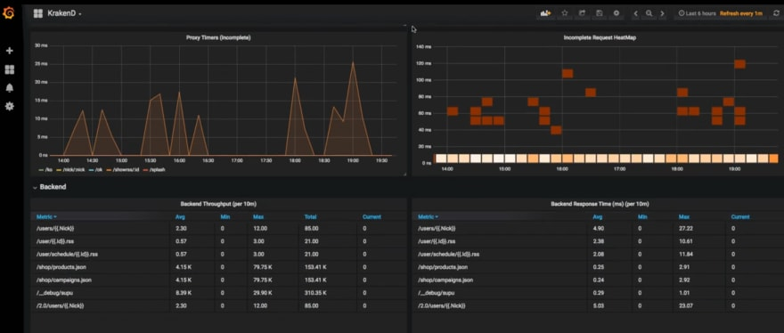

[](/x/)

KrakenD is an ultra-performant open-source Gateway that can transform, aggregate, or remove data from multiple services, with linear scalability.

I will explain how to monitor the status of KrakenD services with Grafana dashboard.



Instead of creating a dashboard from scratch, we can use one of pre-configured dashboards available on grafana.com. In this article, we will use the KrakenD dashboard with ID 5722, prepared by `dlopez`. If you want, you can customize the dashboard according to your needs.

By default, this dashboard provides us with the following metrics:

- Requests from users to KrakenD
- Requests from KrakenD to your backends
- Response times
- Memory usage and details
- Endpoints and status codes
- Heatmaps
- Open connections
- Throughput
- Distributions, timers, garbage collection and etc.

## Prerequisites

- KrakenD

---

## InfluxDB Setup

The dashboard we will use uses InfluxDB to read metric data. You can easily run InfluxDB with Docker.

```bash
docker run -p 8086:8086 \ 
  -e INFLUXDB_DB=krakend \ 
  -e INFLUXDB_USER=myusername -e INFLUXDB_USER_PASSWORD=mypassword \ 
  -e INFLUXDB_ADMIN_USER=admin -e INFLUXDB_ADMIN_PASSWORD=myadminpassword \ 
  -d --name=influx-1.8 \ 
  influxdb:1.8 
```

```bash
docker exec -it influx-1.8 /bin/bash
```

---

## Grafana Setup

If Grafana is not installed, you run it with Docker. After the following command Grafana will be running at `http://localhost:3000`.

```bash
docker run \ 
  -d \ 
  -p 3000:3000 \ 
  --name=grafana \ 
  grafana/grafana 
```

---

## KrakenD Configuration

Add the following configuration to your krakend.json at the root level. After this, your KrakenD metrics will start saving to InfluxDB at `<your-influx-db-server-ip>:8086`.

```json  
{
  "version": 2,
  "extra_config": {
    "github_com/letgoapp/krakend-influx":{
        "address":"http://<your-influx-db-server-ip>:8086",
        "ttl":"25s",
        "buffer_size":0
    },
    "github_com/devopsfaith/krakend-metrics": {
      "collection_time": "30s",
      "listen_address": "127.0.0.1:8090"
    }
  }
}
```

---

## Importing the Grafana Dashboard

1. Go to the browser and open http://localhost:3000. Use `admin` for both username and password

2. Click `Configuration` from side menu and find the button to add the data source. Select InfluxDB as the database and fill the details you provided when starting InfluxDB:

   - Query Language: `InfluxQL`
   - URL: `http://localhost:8086`
   - Access: `Browser`
   - Database: `krakend`
   - User: `admin`
   - Password: `myadminpassword`
   - HTTP Method: `GET`

3. To import the dashboard: Click the `+` icon in the side menu from the Grafana interface and then click `Import`. Select `Import via Grafana.com`. Enter `5722` as the ID and click `Load`. Your dashboard is ready, enjoy it.

## Resources

- [KrakenD Grafana Dashboard on Grafana.com](https://grafana.com/grafana/dashboards/5722)
- [Native InfluxDB exporter](https://www.krakend.io/docs/extended-metrics/influxdb/)
- [Preconfigured Grafana dashboard](https://www.krakend.io/docs/extended-metrics/grafana/)
