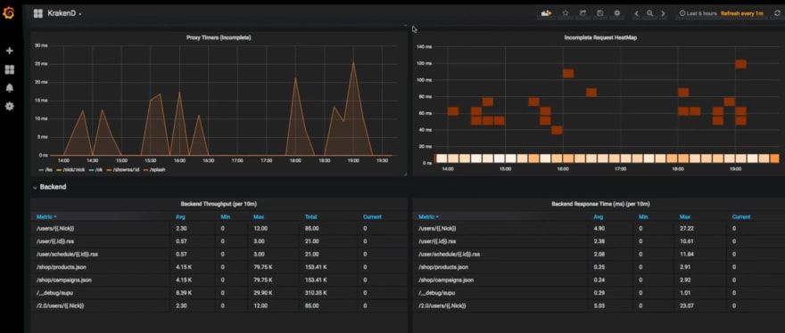

KrakenD, bir veya daha fazla servisten gelen verileri dönüştürebilen, birleştirebilien ve silebilen çok yüksek performanslı, ölçeklendirilebilir açık kaynak kodlu gatewaydir.

Grafana dashboardu üzerinden KrakenD servislerimizin durumunu nasıl takip edeceğimizi açıklayacağım.



Sıfırdan bir dashboard oluşturmak yerine grafana.com'da bulunan önceden hazırlanmış bir dashboard kullanabiliriz. Bu yazıda 5722 id numaralı, dlopez tarafından hazırlanmış KrakenD isimli dashboard'u kullanacağız. Sonrasında ihtiyacınıza göre dashboardu özelleştirebilirsiniz.

Bu dashboard varsayılan olarak bize şu metrikleri sunuyor:

- Kullanıcılardan KrakenD'ye gelen istekler
- KrakenD'den backendlerinize gelen istekler
- Yanıt verme süreleri
- Hafıza kullanım miktarı ve detayları
- Uç noktalar ve durum kodları
- Heatmapler
- Açık bağlantılar
- Throughput
- Dağıtımlar, timerlar, garbage collection vb.

## Ön gereksinimler

- KrakenD

---

## InfluxDB Kurulumu

Kullanacağımız dashboard metrik verilerini okumak için InfluxDB kullanıyor. Docker ile kolayca InfluxDB çalıştırabilirsiniz.

```bash
docker run -p 8086:8086 \ 
  -e INFLUXDB_DB=krakend \ 
  -e INFLUXDB_USER=myusername -e INFLUXDB_USER_PASSWORD=mypassword \ 
  -e INFLUXDB_ADMIN_USER=admin -e INFLUXDB_ADMIN_PASSWORD=myadminpassword \ 
  -d --name=influx-1.8 \ 
  influxdb:1.8 
```

```bash
docker exec -it influx-1.8 /bin/bash
```

---

## Grafana Kurulumu

Eğer Grafana kurulu değilse yine  Docker ile çalıştırabilirsiniz. Komutu çalıştırdığınızda Grafana `http://localhost:3000` adresinde çalışıyor olacak.

```bash
docker run \ 
  -d \ 
  -p 3000:3000 \ 
  --name=grafana \ 
  grafana/grafana 
```

---

## KrakenD Konfigürasyonu

Aşağıdaki konfigürasyonu krakend.json dosyanıza root seviyesinde ekleyin. Bu konfigürasyonu yaptıktan sonra KrakenD metrikleriniz `<your-influx-db-server-ip>:8086` adresindeki InfluxDB'ye kaydedilmeye başlayacak.

```json  
{
  "version": 2,
  "extra_config": {
    "github_com/letgoapp/krakend-influx":{
        "address":"http://<your-influx-db-server-ip>:8086",
        "ttl":"25s",
        "buffer_size":0
    },
    "github_com/devopsfaith/krakend-metrics": {
      "collection_time": "30s",
      "listen_address": "127.0.0.1:8090"
    }
  }
}
```

---

## Grafana'ya Dashboard Kurulumu

1. İnternet tarayıcınız ile `http://localhost:3000` adresine gidin. Hem kullanıcı adı hem de şifre alanlarına `admin` yazarak giriş yapın.

2. Yan menüden `Configuration`'a tıklayın ve data source ekle butonunu bulun. Veritabanı olarak InfluxDB'yi seçin ve Docker ile InfluxDB'yi çalıştırırken girdiğiniz ayrıntıları doldurun:

   - Query Language: `InfluxQL`
   - URL: `http://localhost:8086`
   - Access: `Browser`
   - Database: `krakend`
   - User: `admin`
   - Password: `myadminpassword`
   - HTTP Method: `GET`

3. Dashboardu import etmek için: Grafana arayüzünden yan menüdeki `+` simgesine tıklayın ve ardından `Import`'a tıklayın. `Import via Grafana.com` seçeneğini seçin. Id olarak `5722` girin ve `Load`a tıklayın. Dashboardunuz hazır, güle güle kullanın.

## Kaynaklar

- [KrakenD Grafana Dashboard on Grafana.com](https://grafana.com/grafana/dashboards/5722)
- [Native InfluxDB exporter](https://www.krakend.io/docs/extended-metrics/influxdb/)
- [Preconfigured Grafana dashboard](https://www.krakend.io/docs/extended-metrics/grafana/)
